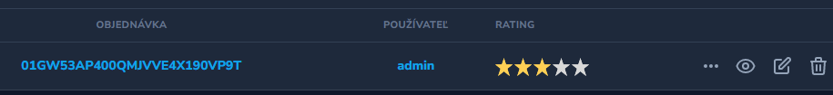
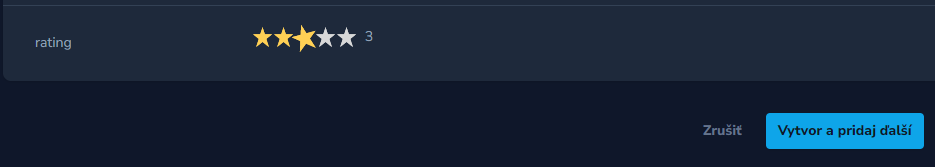

# Laravel Nova Rating Field






## Installation

``` php
composer require wamesk/laravel-nova-rating-input
```

## Usage

``` php
use Wame\RatingField\RatingField;

  RatingField::make(__('field.rating'), 'rating')
    ->required()
    ->rules('required')
    ->sizeStars(21)   // default 20
    ->animate('true')  // default true
    ->maxRating(5)      // default 5
    ->showNumber(true)   // default true
    ->step(1),      // default 1
```

<a href="https://www.npmjs.com/package/vue-star-rating">Vue Star Rating</a> for Laravel Nova 4

<a href="https://codepen.io/craigh411/pen/abNXVQN">Playground</a>


